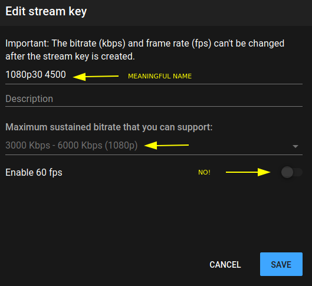
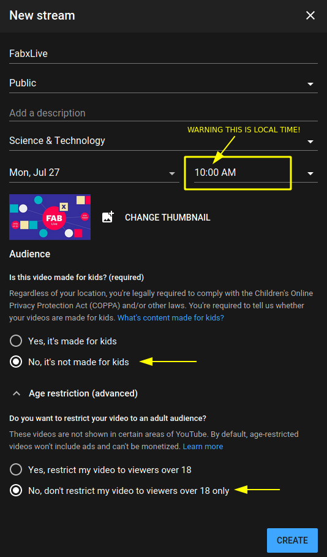
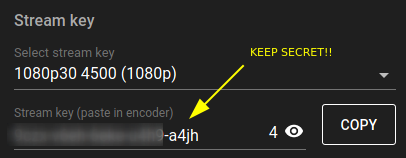
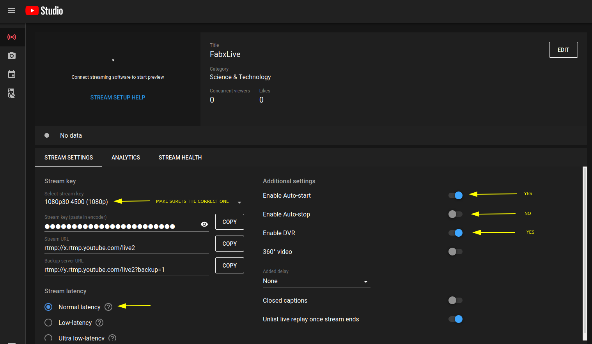
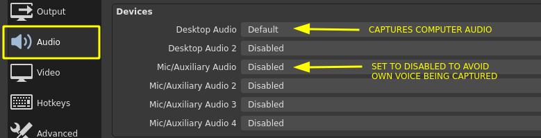
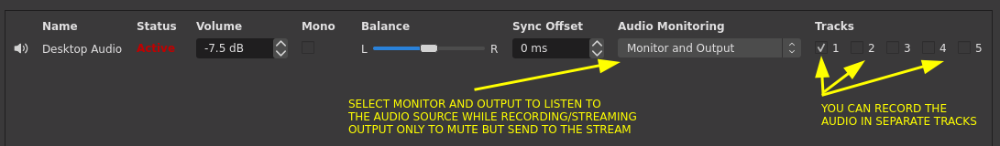
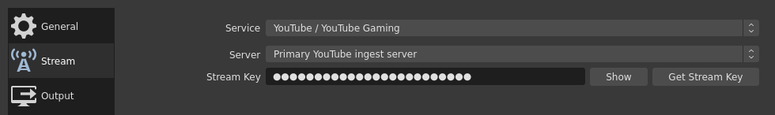
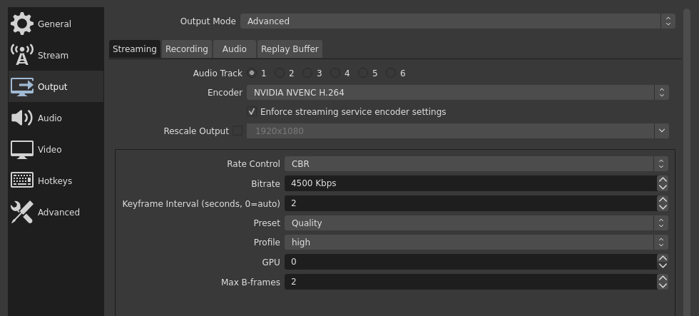
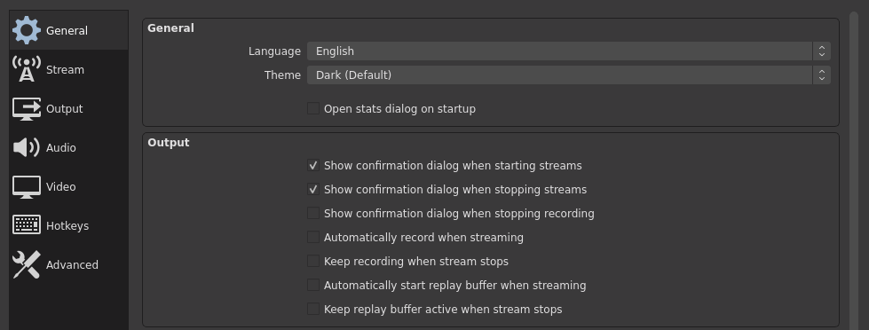
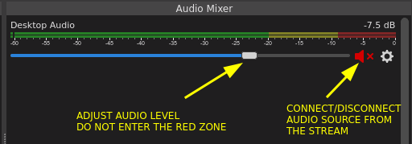

# Streaming

This document describes the streaming procedures for youtube streaming


<!-- vim-markdown-toc GFM -->

* [Overview](#overview)
* [Setup Youtube](#setup-youtube)
	* [Create a youtube streaming key](#create-a-youtube-streaming-key)
	* [Schedule the event](#schedule-the-event)
* [Setup the Computer](#setup-the-computer)
	* [Requirements](#requirements)
	* [Configure OBS and get the scenes and assets](#configure-obs-and-get-the-scenes-and-assets)
	* [Before streaming checklist](#before-streaming-checklist)
* [Streaming Procedure](#streaming-procedure)
	* [Start Streaming Procedure](#start-streaming-procedure)
	* [Stop Streaming Procedure](#stop-streaming-procedure)
	* [Remote control of speaker names](#remote-control-of-speaker-names)
* [Other](#other)
	* [Backup stream](#backup-stream)
	* [Maintenance tasks](#maintenance-tasks)
	* [Embedding the stream in a webpage](#embedding-the-stream-in-a-webpage)
	* [Free music](#free-music)
	* [Warnings](#warnings)
	* [TODO](#todo)
* [Conclusions](#conclusions)
	* [What worked](#what-worked)
	* [What didn't work](#what-didnt-work)
	* [Future improvements](#future-improvements)

<!-- vim-markdown-toc -->


# Overview

The Livestream is based on one or multiple streaming computers. For FabxLive there were 2 computers streaming simultaneously from different locations

```
OBS STUDIO --> YOUTUBE Primary ingest server
  |_ Zoom capture window
  |_ Overlay images
  |_ Titles and text
  |_ Sound effects
  |_ Video
```

If the streaming computer (and mirrors) falls there is an emergency backup stream (untested):

```
ZOOM --> Youtube backup ingest server
```

> **Important note for simultaneous streamers**
> - Video resolution must be the same 1920x1080
> - Video bitrate must be the same CBR 4500
> - Audio bitrate must be the same 160

# Setup Youtube

## Create a youtube streaming key

- 1080p
- Bitrate 3000-6000
- Disable 60fps
- Give the key a meaningful name
- ~~One key per day?~~ One key for all the event  



## Schedule the event

- Beware the time! Youtube will use the local timezone!
- Mark it public
- Add cover image and description  

- Use the streaming key you created
- Keep the key secret! Anyone with the key can start streaming!  

- Automatic start enabled
- Automatic stop disabled
- DVR enabled  



# Setup the Computer

## Requirements

- Recommended Ubuntu 20.04 LTS
- High upload speed (Fran using 600Mbps upload line)
- Use LAN cable, not wifi
- Use dedicated computer
- Use hardware encoder
  - Nvidia NVENC (success so far)
  - Intel VAAPI (Fran tests youtube chokes/buffers sometimes)
- UPS for router/computer
- Dual screen minimum (4 recomended)

## Configure OBS and get the scenes and assets

- Clone the [FXL repository](https://gitlab.fabcloud.org/fabevent/fabxlive/management)
- Install the official [karla](files/karla.zip) and [Norwester](files/norwester_font.zip) fonts in the system
- TODO: Import the scenes located in the folder [stream-assets](files/stream-assets) in OBS (in the top menu *Scene collection/import*)
- Check that the images and video sources are properly linked
- Make sure you are only capturing the Desktop Audio in settings and not your mic  

- Decide if you want to record audio sources in separate tracks and if you want to monitor the audio while recording/streaming  


## Before streaming checklist

- Check LAN cable connection is active
- Start OBS
- Join ZOOM call with name "Streaming", mute mic and camera
- Computer Stream **cannot be the host**. It must transfer the ZOOM host before start broadcasting and remain as co-host. Reason: An overlay appears to the host when someone is in the waiting room. This overlay is visible in the stream.
- In OBS settings make sure the monitoring device is properly set and captures computer audio and ZOOM audio
- In OBS make sure that other audio sources output sound directly or through *Desktop Audio*
- In OBS settings make sure the streaming key is correct and streaming parameters are correct  

- In OBS settings make sure the stream settings are CBR, 4500 Kbps, 2s keyframe  

- In OBS settings make sure confirmation before start/stop streaming is activated  

- Check that remote control is accesible and working for both stream clones


# Streaming Procedure

## Start Streaming Procedure

- Select Black scene in Computer stream
- Computer stream mutes Desktop audio source
- Start streaming in Computer Stream
- Select GET READY scene in Computer timer
- Select INTRO scene in Computer Stream. Hold it for 30s
- Computer timer reminds ZOOM call
  - That we are 30s away to go ONAIR
  - Everybody except the moderator mutes
  - To wait for the ONAIR green mark to start
  - To start ZOOM cloud recording now
  - Ask the moderator to talk to get focus
- Computer Timer mutes itself
- After 30s Computer stream switches to ZOOM scene in OBS
- Computer stream unmutes desktop audio source  

- Computer Timer blinks ONAIR green and goes back to FXL Logo scene

## Stop Streaming Procedure

- Stay alert for the 'bye-byes' cue
- Computer Stream switches to cover scene in OBS
- Computer stream mutes Desktop Audio source (audio source from ZOOM)
- Stop streaming in Youtube page
- Breath again

## Remote control of speaker names

There was a web interface with some PHP code to change a `current_name.html` file in the server, that OBS was pulling. 

<http://syn.thetic.party/fabxlive-control-panel-27-07-2020.html>

# Other

## Backup stream

- Secondary OBS stream
- To check: streaming to multiple platforms <https://restream.io/>
- To check: zoom streaming
- To check: <https://vimeo.com/features/livestreaming>

## Maintenance tasks

- Download, archive, backup and delete ZOOM cloud recordings after the session. Log in to ZOOM website with the FFF account (forum@fabfoundation.org)

## Embedding the stream in a webpage

To avoid changing URL of the stream we embed the channel ID URL

`<iframe width="100%" height="800" src="https://www.youtube.com/embed/live_stream?channel=UC02rOPpBb1EwVu25ib9L0NA" frameborder="0" allowfullscreen></iframe>`

TODO
- make a responsive embed (now fixed)
- read the [YT player API](https://developers.google.com/youtube/iframe_api_reference)

## Free music

- From Canva (is licensed against FF youtube channel)
- Jamendo (warning this project might be considered commercial, make sure the license allows)

## Warnings

- (severe) Do not use copyright music. If video contains music perform test stream way beforehand
- (severe) Communicate no-copyrigh-music to speakers

## TODO

- [x] What happens if 2 computers stream at the same time? Answer: Nothing. When one computer fails, Youtube continues on the secondary stream
- [x] Create a streaming landing page e.g ~~live.fabevent.org~~ <https://fabxlive.fabevent.org/live>
- [x] Test zoom backup streaming. Successfully tested with Christian
- [x] Create artwork and video animations for the OBS scenes (canva?)
- [x] Create scenes and share them across

# Conclusions

## What worked

- OBS Studio is a very powerful broadcasting software. With the addition of plugins it gets even more powerful (NDI cameras, remote control with websockets, special effects...). It had some limitations, see below.
- The setup does not require expensive hardware. Fabxlive was streamed from a 2017 laptop with an external Nvidia 2070 Super GPU for hardware encoding. Probably just a laptop with a similar integrated GPU could do the job as well.
- We used a digital PTT walkie-talkie for internal comunication that turned out to be very useful. It was using the open source software [Mumble](https://www.mumble.com/)
- The underestimated ffmpeg saved my life several times. Concatenating, reencoding, generating clips from images, you name it.

## What didn't work

- At the time of writing, in OBS Studio there is no way to create a slideshow with mixed images and videos. This forced us to create complex scenes that had to be manually triggered. It was very time consuming and it was the main source of errors during the stream.
- Audio glitches and problems in OBS. These are probably related to Fran ignorance while messing with the internals of pulseaudio, alsa and jack.
	- I could not monitor the true level of the output audio send to the stream. I had to check on Youtube (20-30s delay)
	- Lowering the level of an audio source down to zero caused full volume white noise audible on the stream. [Example here](https://youtu.be/DIzAConaJVk?t=7004)
- We should get rid of ZOOM videoconferencing. Main issues were:
	- It consumes too many computer resources
	- With a dual monitor setting activated (required to capture separately in full screen the screenshare and the video feed), if you pin a camera in the secondary screen it wont remain pinned. Sometimes it will change to the person speaking for a few seconds. Then back to the pinned camera. [Example here](https://youtu.be/DIzAConaJVk?t=6854)
	- When someone shares their screen, ZOOM changes my layout from speaker view to gallery view. Pinning a camera does not help. This forces us to be aware and quickly change et back to speaker view. [Example here](https://youtu.be/DIzAConaJVk?t=5626)
- FabCloud
	- The file size limitation and lack of git skills across the team made a nasty mix of Google drive and gitlab
	- As a team we need to be more consistent in writing markdown to make text more organized and easy to read (proper use use of headers, formatting, TOCs, etc.)
- Google drive (this is Fran personal thought)
	- People abuse of spreadsheets and google docs where plain text is just enough
	- Interface is nasty, slow
- Controlling copyrighted music in external content from the network. There is lack of tools to check. Youtube does not identify instantly so it can happen after an hour or a month or a whenever Youtube scans/rescans your stream.
- Names were not very responsive at times (using PHP to change an html file that OBS pulls). 

## Future improvements

- Explore other video conferencing platforms. Ideally we should be able to pull individual video sources on demand
- I found out Nvidia artificially blocks the capabilities of its consumer videocards. But these limitations can be removed with a patch <https://github.com/keylase/nvidia-patch>. The patch removes restriction on maximum number of simultaneous NVENC video encoding sessions imposed by Nvidia to consumer-grade GPUs. I wonder if this could be used to receive individual video feeds and process them like a MCU. The patch also allows to use NvFBC on consumer-grade GPUs, wich is supossed to reduce the load/be faster to capture the screen. (currently testing the patch and obs-nvfbc source)
- Build dedicated hardware to interface with the software and speed up/reduce errors while adjusting the controls. Probably a slider extension of my stream-deck solution <https://github.com/TheBeachLab/stream-deck>
- Use [mods](https://github.com/fabfoundation/mods) to remote control the change of names through websockets using the [Set Freetype2 properties](https://github.com/Palakis/obs-websocket/blob/4.x-current/docs/generated/protocol.md#settextfreetype2properties)
- In relation with the above, prepare easy-to-use interfaces for the volunteers to be able to remote control some aspects of the stream
