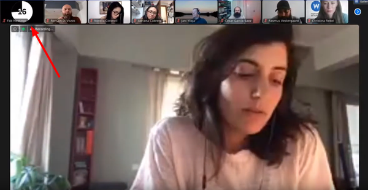

# ZOOM timer for speakers

This document describes the setup and usage of the ZOOM timer


<!-- vim-markdown-toc GFM -->

* [Overview](#overview)
* [Requirements](#requirements)
* [Computer installation](#computer-installation)
* [Get the OBS scenes and assets](#get-the-obs-scenes-and-assets)
* [Operation](#operation)
* [Remote control](#remote-control)
* [Conclusions](#conclusions)
	* [What worked](#what-worked)
	* [What didn't work](#what-didnt-work)
	* [Future improvements](#future-improvements)

<!-- vim-markdown-toc -->

## Overview

The ZOOM timer is a user connected to ZOOM which displays speaker time using a virtualcam and OBS Studio. This is NOT visible in the Youtube Broadcast, it is only visible for the ZOOM participants.



## Requirements

- Recommended Ubuntu 20.04 LTS

## Computer installation

Install caffeine and caffeine indicator to prevent the computer to sleep

Install OBS from the snap wich is already compiled with all necessary plugins:

```
sudo snap install obs-studio
sudo snap connect obs-studio:audio-record
sudo snap connect obs-studio:camera
sudo snap connect obs-studio:removable-media
```

Install `v4l2loopback`:

```
sudo apt -y install v4l2loopback-dkms v4l2loopback-utils
echo "options v4l2loopback devices=1 video_nr=99 card_label=VirtualCam exclusive_caps=1" | sudo tee /etc/modprobe.d/v4l2loopback.conf
echo "v4l2loopback" | sudo tee /etc/modules-load.d/v4l2loopback.conf
sudo modprobe -r v4l2loopback
sudo modprobe v4l2loopback devices=1 video_nr=99 card_label=VirtualCam exclusive_caps=1
```

Install ZOOM from the software center.

## Get the OBS scenes and assets

- Import the scenes located in the folder [timer-assets](files/timer-assets) in OBS (in the top menu *Scene collection/import*)
- Check that the video sources are properly scaled and linked

## Operation

- Boot the computer and start/activate caffeine indicator
- Open OBS and start the virtual camera output using `/dev/video99` as the path to V4L2 device in `Tools -> V4L2 Video Output`
- Start ZOOM and sign-in with the FFF account (forum@fabfoundation.org)
- Start the scheduled meeting
- Use the `Virtualcam` camera and activate it
- Mute
- Test the scenes

## Remote control

> Warning: There are no partial permissions, create an user interface that only displays what the remote user must control.

- If you don't have a fixed IP create a dynamic dns service for easier remote control
	- fabxlive1.ddns.net (Fran main stream)
	- fabxlive2.ddns.net (Christian backup stream)
- In OBS go to Tools/Websockets and enable Websockets server in port 4444. Enable authentication and only share the password with the remote user.
- Control main Timer with this address:
 <http://t2t2.github.io/obs-tablet-remote/#!auto&host=fabxlive1.ddns.net&port=4444&password=PASSWORD>

## Conclusions

### What worked

- This solution turned out to be  non intrusive
- It was versatile and fast to edit the messages shown

### What didn't work

- Since it is based on a camera, the presenter in ZOOM can only see the first 3 cameras when they are sharing their screen. Sometimes they were unaware of time was up. A workaround was to mute all cameras before the timer so that it shows the first.

### Future improvements

- Create a non intrusive sound to alert the speaker that time's up
- Generate the timers dynamically instead of using a video file
- Use it as a teleprompter
- Is there another solution that does not require OBS and can be remotelly controlled?
